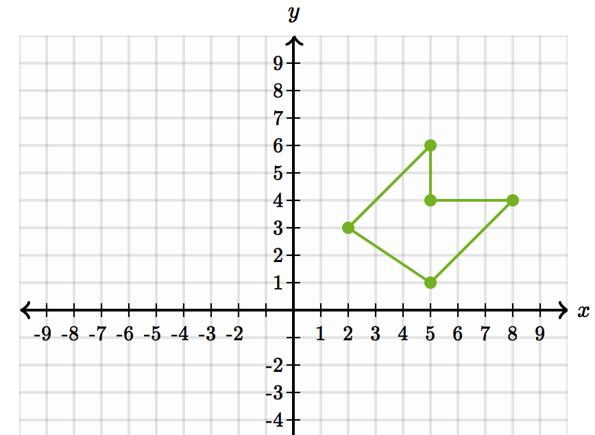
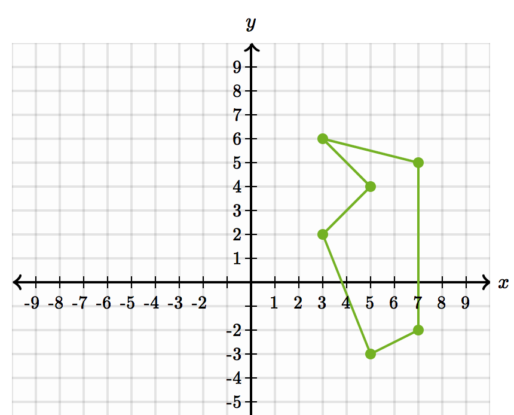
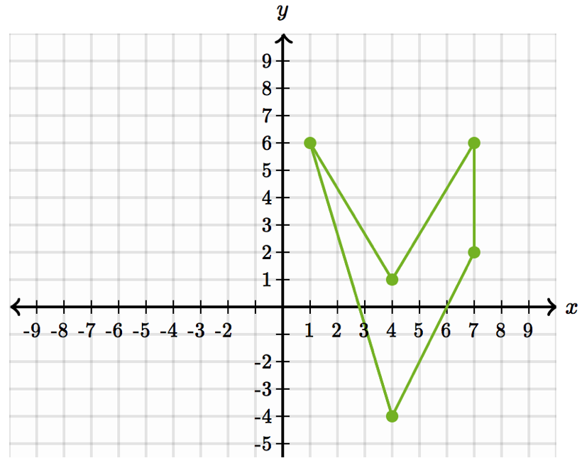
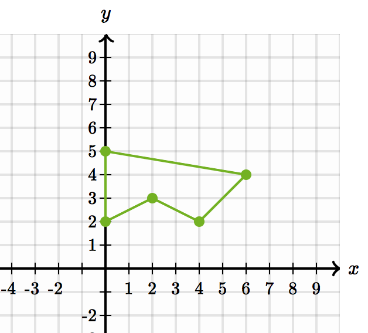
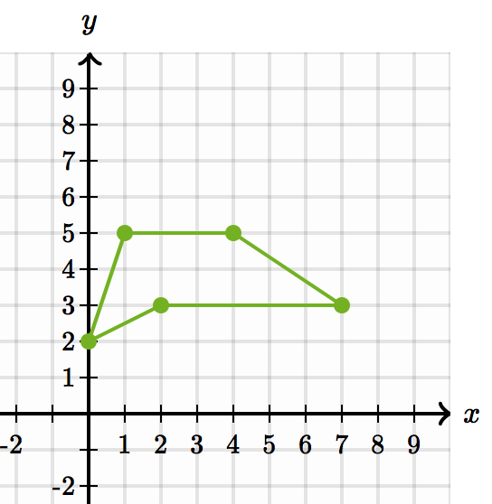
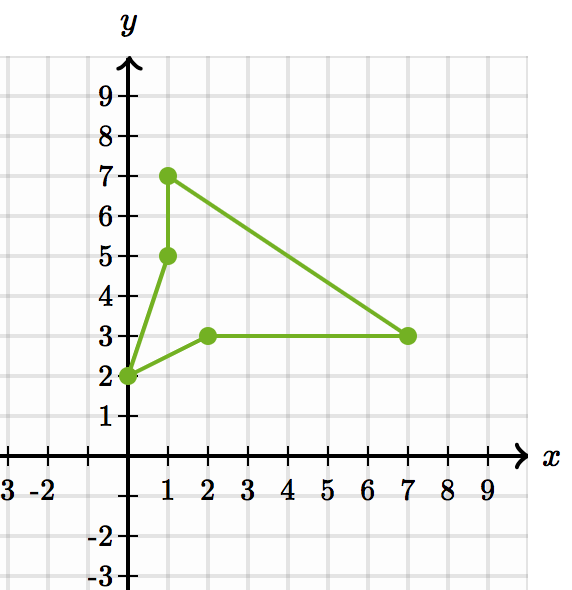

# Test Cases

## Cartesian

Polygons are drawn using [this tool](https://www.khanacademy.org/math/basic-geo/basic-geo-coord-plane/polygons-in-the-coordinate-plane/e/drawing-polygons). Vertices for polygon go clockwise.

### poly1



```
const poly1 = [
{ longitude: 2, latitude: 3 },
{ longitude: 5, latitude: 6 },
{ longitude: 5, latitude: 4 },
{ longitude: 8, latitude: 4 },
{ longitude: 5, latitude: 1 }
];
```


### poly2



```
const poly2 = [
{ longitude: 3, latitude: 2 },
{ longitude: 5, latitude: 4 },
{ longitude: 3, latitude: 6 },
{ longitude: 7, latitude: 5 },
{ longitude: 7, latitude: -2 },
{ longitude: 5, latitude: -3 }
];
```

### poly3



```
const poly3 = [
{ longitude: 1, latitude: 6 },
{ longitude: 4, latitude: 1 },
{ longitude: 7, latitude: 6 },
{ longitude: 7, latitude: 2 },
{ longitude: 4, latitude: -4 }
];
```

### poly4



```
const poly4 = [
{ longitude: 0, latitude: 2 },
{ longitude: 0, latitude: 5 },
{ longitude: 6, latitude: 4 },
{ longitude: 4, latitude: 2 },
{ longitude: 2, latitude: 3 }
];
```

### poly5



```
const poly5 = [
{ longitude: 0, latitude: 2 },
{ longitude: 1, latitude: 5 },
{ longitude: 4, latitude: 5 },
{ longitude: 7, latitude: 3 },
{ longitude: 2, latitude: 3 }
];
```

###poly6



```
const poly6 = [
{ longitude: 0, latitude: 2 },
{ longitude: 1, latitude: 5 },
{ longitude: 1, latitude: 7 },
{ longitude: 7, latitude: 3 },
{ longitude: 2, latitude: 3 }
];
```

## GeoJson

[testcases](https://github.com/hopeonesource/geospatial_posts/tree/master/test_data)
- arlington_county_boundary.geojson - the polygon
- test_pts_arlington.geojson - the points we are trying to determine if they lie inside the polygon.
